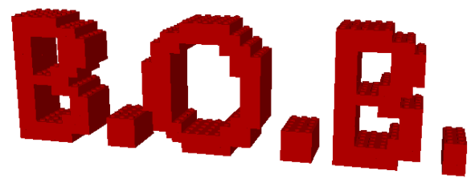
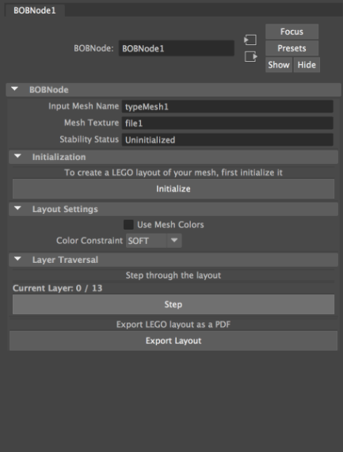
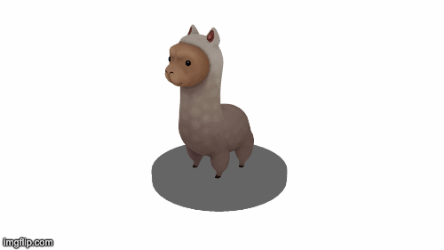

Brick-Optimization-Builder (B.O.B)
====================================
<p align="center">
  
</p>

## I. Project Summary
This tool is based on the paper [Legolization: Optimizing LEGO Designs](from paper: https://graphics.cmlab.csie.ntu.edu.tw/~forestking/research/SIGA15-Legolization/).

The goal of this project is to implement a tool for the creation and analysis of LEGO brick layouts. The usefulness of such a tool arises from the difficulty of both designing LEGO layouts and estimating their stability. There are many tools available for digitally constructing a LEGO model. This takes the tedium out of having to deconstruct failed designs or portions of sculptures in the middle of construction because the user already knows what the finished arrangement of bricks will look like as well as how many of each type are necessary. However, such tools do not tell the user if the digital model will hold up in real life and that is what our tool seeks to remedy. 

We envision a variety of people using our tool. These users include both professional LEGO sculptures as well as amateurs who construct unique models as a hobby. Our tool would also be useful for CG artists wanting to make a scene constructed of LEGOs (as is seen in the LEGO movies) in which case stability analysis may still be important depending on if simulations are intended to be run on the output. 
The general process for using our tool is straightforward. Once the user has a desired mesh he or she would like to legolize, a custom MPxNode can be created with the mesh selected. We call this a BOBNode. Initializing the BOBNode will already give the user a singularly connected LEGO mesh, visualized in the Maya scene. Running stability iterations on the mesh will find a physically sound layout that can be used as a basis for constructing a real LEGO structure. Runtime will be largely dependent on the scale of the input mesh and the complexity of its surface.

The tool will be developed as a Maya plugin with the Maya C++ API as well as some MEL scripting for tool setup. Implementation will be based on the paper Legolization: Optimizing LEGO Designs. The next few weeks will be devoted to generating a valid LEGO layout while the remainder will be primarily devoted to finding a valid and stable layout.

## II. Design Goals
Our tool will allow a user to create a mesh and convert that mesh into a physically realizable LEGO model. There will be controls for color constraints and number of iterations but due to the straightforwardness of the desired output (from the user’s perspective), the interface will be quite simple. This will also allow the tool to be accessible for a wide range of users, not just those familiar with computer graphics or our implementation details. The given input mesh will be taken and used as the basis for forming a stable LEGO layout. This is achieved with global stability analysis of the mesh followed by refinement of the weakest areas. We are further able to compute a value measuring how stable the mesh is and can thus notify the user when a desirable layout has been reached. This tool will be developed as a Maya Plugin with the Maya C++ API as well as with the MEL scripting language.

### Target Audience
We anticipate our target audience to simply be those who want to design complex LEGO models without having to go through the tedium of guessing whether or not their design is stable before a build. While familiarity with the Maya interface is certainly useful, we intend our tool to be usable for anyone as long as he or she has a mesh to use as input. As mentioned prior (and in subsequent sections) our user interface is streamlined such that it doesn’t take long to learn the workflow. Therefore, we will develop a tool for use by both professional and amateur LEGO designers. As most LEGO development is currently done digitally through systems like LDraw, we believe that becoming acquainted with our tool will not be a difficult task. 

### User Goals and Objectives
A LEGO designer will use this tool to create a stable LEGO layout for their design, thereby cutting the time it takes to find a stable solution. He or she will then be able to construct this model in real life with the knowledge that the build will be successful.

### Tool Features and functionality
Our tool has one objective and that is to eventually provide the builder with a stable layout for their LEGO design. The user will have access to BOBNodes which are described in greater detail below. Using these nodes, a user can modify the type of color constraint they wish to have on their model as well as how many times they wish to iterate over the model. The user also has the power to reset the mesh to an initial LEGO configuration and begin the refinement process again if he or she is unhappy with the output, or a fail state is reached. 

### Tool Input and Output
The input to our tool is a 3 dimensional mesh present in the current Maya scene. A BOBNode can be created just with keypresses by selecting said mesh and going to the menu bar to create a BOBNode. Most attributes on the BOBNode can then be modified just using a mouse or trackpad though keyboard inputs are necessary for modifying the maximum number of iterations (seen in the proxy GUI below). All other operations are performed through button presses.

Our tool creates a mesh composed of LEGO geometry as output. If choosing to iterate manually (that is, “Iterate until stable” is not checked), the user can see whether or not this layout is stable through the BOBNode attributes. Time permitting, we may also investigate using another third party software to output a .pdf file with images of each layer of the final LEGO mesh to act as an instruction set for the user. 

## III. Software Design and Development
We used the following classes and data structures to carry out the algorithms presented in our paper. 

Brick:
The brick class represents LEGO (Brick) objects. They formed the building blocks for the entire tool and contain the following information:
Connected Component ID: ID to associate each brick with its connected component that is calculated once per iteration of the stability aware refinement algorithm.
Individual ID: unique ID for each brick. This is used to check neighboring bricks in the brick grid (described below). 
Enum type: the type of LEGO block this brick represents. For example, it could be a 1x1, 2x1, 2x2 etc. lego and this inherently tells us the scale of the brick as well.
Position: position in world space of the brick
Rotation: rotation of the brick about the world y-axis (since all bricks are axi aligned)
Color: color associated with this brick. This is defined based on the original input mesh. 
	
Grid:
The grid class holds information representing the entire LEGO sculpture. It allows us to access LEGOs in an organized fashion, thus speeding up computations like searching for neighbors surrounding a given brick as well as determining which LEGOs are connected. It has the following member variables:
Array baseGrid: the private, internal data structure used to store Brick pointers
Dimensions: a 3-dimensional vector storing the size of our bounding box and thus internal grid size

Graph:
The graph class is a helper class for representing connectivity of bricks. It is accessible by the Grid class and used for determining connected components. The underlying structure of each graph is an adjacency list with nodes being Brick* objects. It also has a method for computing connected components by running Depth First Search on its nodes.

MPxNode (BOBNode):
The MPxNode created for our authoring tool is its primary component, representing the legolization process as a whole. Each node maintains a Grid object that holds all current bricks in the mesh reconstruction. On initialization, a BOBNode takes its input mesh and voxelize it. The voxelized mesh is then used to populate the Grid member variable with 1x1 brick objects. The compute method of the node is used to perform improvements on the current brick layout with the stability analysis method outlined above. 
	
Our end result is an MFnArrayData object with transformation values. These values are then used to instance geometry and provide the user with a visual representation of the legolized mesh. 

## IV. Installation and Setup
Hardware: MacOS.

To run the project on your computer, first clone it. Then build the project with your favorite C++ compiler. We recommend using QT Creator with Clang. Before building the project, change the `projPath` at the top of `bobnode.cpp` to the root directory of your project. Also on line 3 inside of BOBNodeGUI.mel, change the directory to your base directory. 

After building your project, go into your terminal and copy the `AEBOBNodeTemplate.mel` file into the path of your Maya's environment. To find this, open up Maya and type into the Maya editor `getenv MAYA_SCRIPT_PATH`. Finally, head to your terminal to install the pdf export package [pymupdf](https://github.com/pymupdf/PyMuPDF). Type the following commands into your terminal (make sure [pip](https://pip.pypa.io/en/stable/) is installed):

```
$cd /Applications/Autodesk/maya20[xx]/Maya.app/Contents/bin
$./mayapy -m pip install pymupdf
```

Now we are ready to import the plugin into Maya. Make sure you have Maya developer packages installed (should come by default if you just install Maya from the Autodesk website). Next, open up Maya (any version from 2017 and newer should work) and go to Windows > Settings/Preferences > Plug-in Manager and click on the Browse button. Locate the bundle file that was compiled from your project. You should see the `BOBNode` option added to your topmost panel to the right of `Help`. 

To create a BOBNode instance, click on a mesh in the scene and click BOBNode > createBOBNode. You should see the following GUI:

<p align="center">
  
</p>

Pre-Initialization: There are two things to consider before creating the LEGO layout. If the mesh has a texture you would like reflected in the final LEGO model, check “Use Mesh Colors.” 
Note: Unless this box is checked, you will not be able to export the layout as a pdf or step through the layout after initialization. This is because the layout is otherwise created using instancing
The second thing to consider is whether or not you want to strictly stick to the color boundaries specified by the texture. The color constraint dropdown has two options, “SOFT” and “HARD.” Soft color constraints will merge two bricks even if they aren’t the same color and assign the new brick color arbitrarily. Hard color constraints will only merge two bricks if they have the same original color. This will affect the final color output, and again can only be used if “Use Mesh Colors” is checked. Once you have decided these attribute values, press “Initialize.”

Post-Initialization: If mesh colors were used, the mesh can be navigated with the “Step” button in the node’s attribute editor. This will loop through the layers of the mesh as well as indicate the current highest visible layer. A pdf format of each layer (as an instruction manual) can be generated with the “Export” button. Pressing “Export” will open a file dialog for you to specify the output file path. Once a path is selected, the pdf will begin generation. 

## Happy Lego-ing~!

<p align="center">
  
</p>


